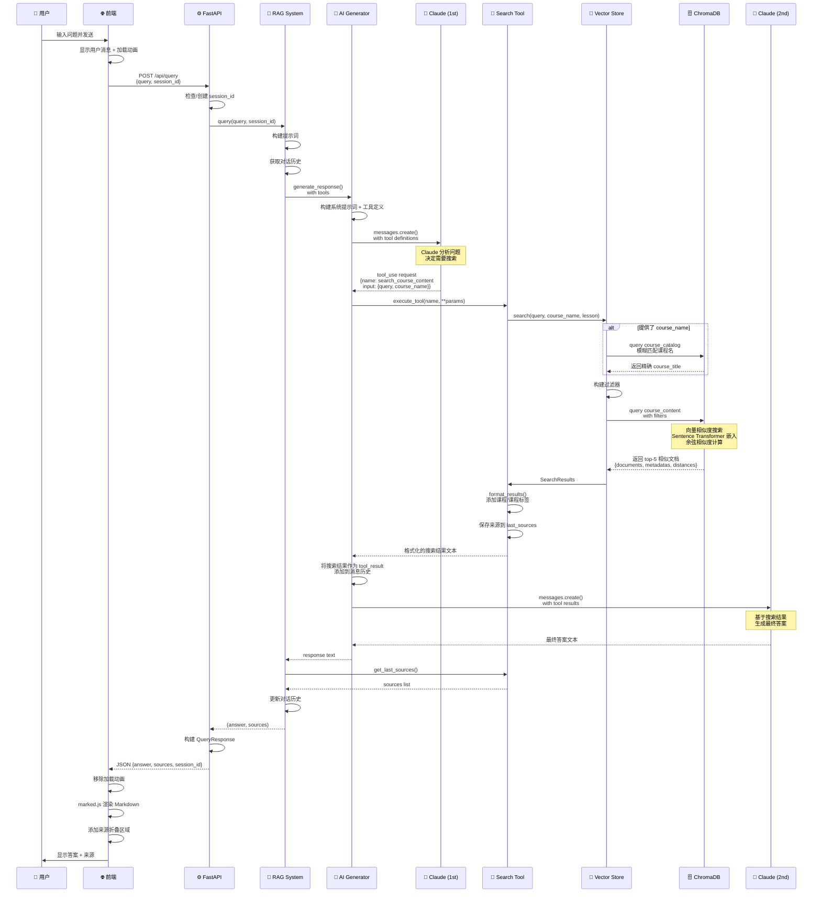
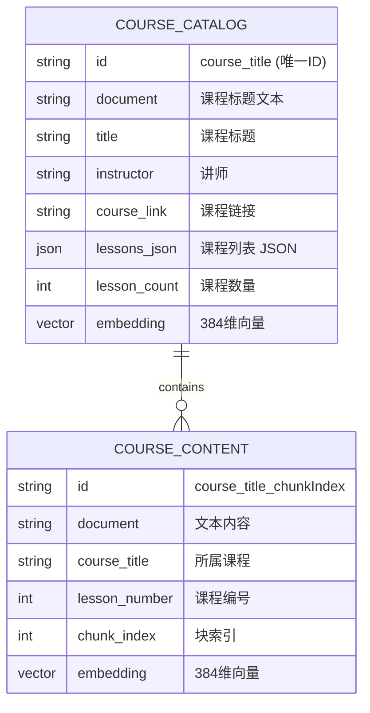
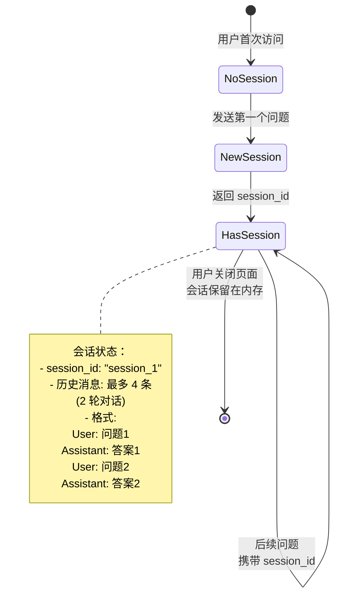
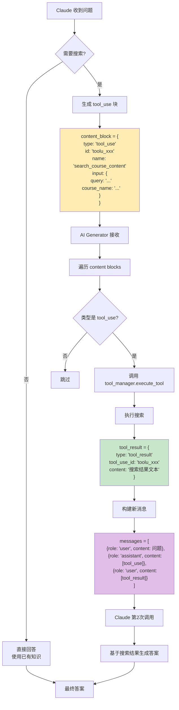
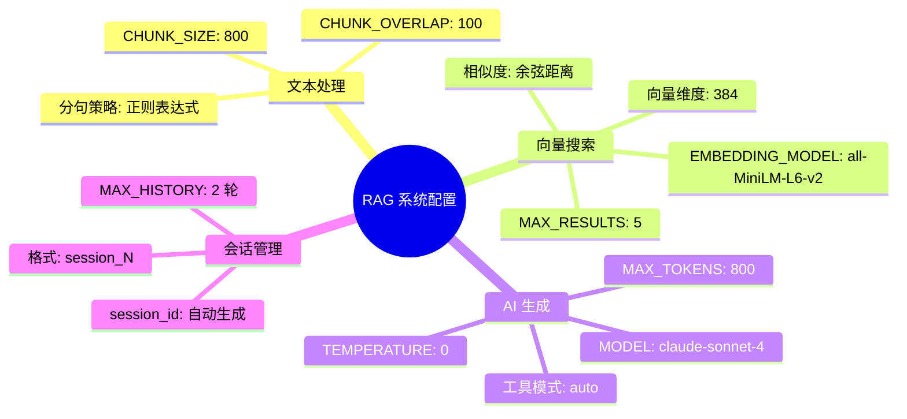
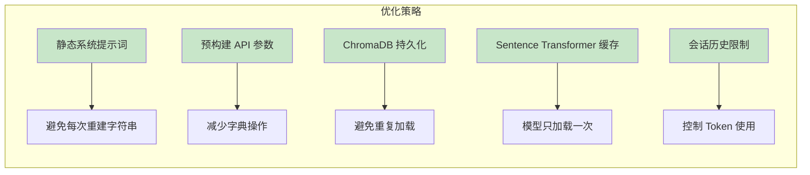

# RAG 聊天机器人查询处理流程图

## 完整架构流程图

```mermaid
graph TB
    %% 前端层
    subgraph Frontend["🌐 前端层 (Frontend)"]
        A[👤 用户输入问题] --> B[script.js: sendMessage]
        B --> C{禁用输入框<br/>显示加载动画}
        C --> D[POST /api/query<br/>{query, session_id}]
    end

    %% FastAPI 层
    subgraph Backend["⚙️ 后端层 (Backend)"]
        D --> E[app.py: query_documents]
        E --> F{检查 session_id}
        F -->|不存在| G[创建新会话]
        F -->|存在| H[rag_system.query]
        G --> H
    end

    %% RAG 系统层
    subgraph RAGSystem["🧠 RAG 系统层"]
        H --> I[构建提示词]
        I --> J[获取对话历史<br/>session_manager]
        J --> K[ai_generator.generate_response<br/>带工具定义]
    end

    %% AI 生成层
    subgraph AILayer["🤖 AI 生成层"]
        K --> L[准备 API 参数<br/>system prompt + tools]
        L --> M[Claude API 第1次调用]
        M --> N{Claude 决策}
        N -->|直接回答| O[返回文本答案]
        N -->|需要搜索| P[返回 tool_use 请求]
    end

    %% 工具执行层
    subgraph ToolLayer["🔧 工具执行层"]
        P --> Q[tool_manager.execute_tool]
        Q --> R[search_tool.execute<br/>query, course_name, lesson_number]
        R --> S[vector_store.search]
    end

    %% 向量存储层
    subgraph VectorLayer["💾 向量存储层"]
        S --> T{提供了 course_name?}
        T -->|是| U[_resolve_course_name<br/>模糊匹配课程]
        T -->|否| V[构建过滤器]
        U --> V
        V --> W[ChromaDB.query<br/>course_content 集合]
        W --> X[向量相似度搜索<br/>返回 top-5]
    end

    %% 结果处理层
    subgraph ResultLayer["📊 结果处理层"]
        X --> Y[format_results<br/>添加课程/课程上下文]
        Y --> Z[保存来源到 last_sources]
        Z --> AA[返回格式化文本]
        AA --> AB[Claude API 第2次调用<br/>基于搜索结果生成答案]
    end

    %% 响应返回层
    subgraph ResponseLayer["📤 响应返回层"]
        O --> AC[获取最终答案]
        AB --> AC
        AC --> AD[tool_manager.get_last_sources]
        AD --> AE[rag_system 返回<br/>answer, sources]
        AE --> AF[app.py 构建响应<br/>QueryResponse]
        AF --> AG[JSON 返回给前端]
    end

    %% 前端渲染层
    subgraph FrontendRender["🎨 前端渲染层"]
        AG --> AH[script.js 接收响应]
        AH --> AI[移除加载动画]
        AI --> AJ[marked.js 渲染 Markdown]
        AJ --> AK[添加来源折叠区域]
        AK --> AL[👤 用户看到答案]
    end

    %% 样式定义
    classDef frontend fill:#e1f5ff,stroke:#01579b,stroke-width:2px
    classDef backend fill:#f3e5f5,stroke:#4a148c,stroke-width:2px
    classDef ai fill:#fff3e0,stroke:#e65100,stroke-width:2px
    classDef vector fill:#e8f5e9,stroke:#1b5e20,stroke-width:2px
    classDef result fill:#fce4ec,stroke:#880e4f,stroke-width:2px

    class A,B,C,D,AH,AI,AJ,AK,AL frontend
    class E,F,G,H backend
    class K,L,M,N,O,P,AB,AC ai
    class S,T,U,V,W,X vector
    class Y,Z,AA,AD,AE,AF,AG result
```

---

## 数据流详细视图



---

## 核心组件交互图

```mermaid
graph LR
    subgraph "前端"
        UI[用户界面]
    end

    subgraph "FastAPI 应用"
        EP[/api/query 端点]
    end

    subgraph "RAG 系统核心"
        RAG[RAG System<br/>rag_system.py]
        SM[Session Manager<br/>会话管理]
        DP[Document Processor<br/>文档处理]
    end

    subgraph "AI 生成"
        AIG[AI Generator<br/>ai_generator.py]
        TM[Tool Manager<br/>工具管理器]
        ST[Search Tool<br/>搜索工具]
    end

    subgraph "存储层"
        VS[Vector Store<br/>vector_store.py]
        CD[ChromaDB<br/>向量数据库]
    end

    subgraph "外部服务"
        Claude[Anthropic Claude API]
    end

    UI -->|HTTP POST| EP
    EP --> RAG
    RAG --> SM
    RAG --> AIG
    AIG -->|第1次调用| Claude
    Claude -->|tool_use| TM
    TM --> ST
    ST --> VS
    VS --> CD
    CD -->|搜索结果| VS
    VS -->|格式化结果| ST
    ST -->|tool_result| AIG
    AIG -->|第2次调用| Claude
    Claude -->|最终答案| AIG
    AIG --> RAG
    RAG --> EP
    EP -->|JSON| UI
    DP -.->|启动时加载| VS

    style Claude fill:#ff6b6b,stroke:#c92a2a,color:#fff
    style CD fill:#4ecdc4,stroke:#0a6e68,color:#fff
    style RAG fill:#ffe66d,stroke:#f9c74f,color:#000
```

---

## 向量搜索详细流程

```mermaid
graph TD
    A[用户查询: What is MCP?] --> B[AI Generator]
    B --> C{Claude 决定<br/>使用搜索工具}
    C -->|tool_use| D[search_course_content<br/>query: MCP<br/>course_name: MCP Course]

    D --> E[Vector Store Search]

    E --> F[步骤1: 解析课程名]
    F --> G[ChromaDB.query<br/>collection: course_catalog<br/>query: MCP Course]
    G --> H[向量匹配]
    H --> I[返回: MCP: Build Rich-Context AI Apps]

    I --> J[步骤2: 构建过滤器]
    J --> K{filter = <br/>course_title: MCP: Build Rich-Context AI Apps}

    K --> L[步骤3: 搜索内容]
    L --> M[ChromaDB.query<br/>collection: course_content<br/>query: MCP<br/>where: filter]

    M --> N[Sentence Transformer<br/>将 MCP 转为 384 维向量]
    N --> O[计算余弦相似度<br/>所有 course_content 向量]
    O --> P[应用过滤器<br/>只保留 MCP 课程]
    P --> Q[排序并返回 top-5]

    Q --> R[SearchResults<br/>documents + metadata]
    R --> S[格式化结果]
    S --> T["[MCP Course - Lesson 1]<br/>MCP stands for Model Context Protocol...<br/><br/>[MCP Course - Lesson 2]<br/>MCP allows AI applications to..."]

    T --> U[返回给 Claude]
    U --> V[Claude 生成最终答案]

    style A fill:#e3f2fd
    style V fill:#c8e6c9
    style N fill:#fff9c4
    style O fill:#fff9c4
```



---

## 数据库结构



---

## 会话管理流程



---

## 工具调用详细流程



---

## 关键配置参数



---

## 性能优化点



